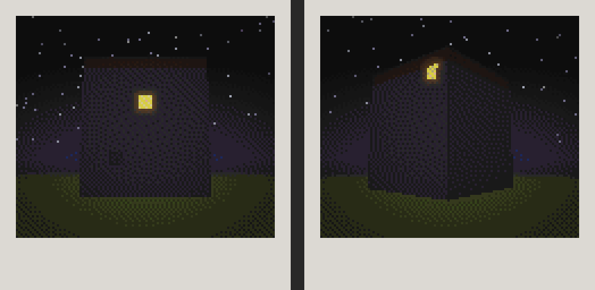

# The opening sequence

Everything that happens before a player first enters the House: settling in, Navidson's letter and photograph, Hillary's arrival, and the walk to the Navidsons' manor. Each player runs their own opening timeline. The code lives in `io.github.knaitoe.theoldesthouse.opening`.

The opening deliberately does **not** put an impossible doorway in the player's home. The player's own house remains mundane. The first impossible architectural change belongs inside The Oldest House, after the player has had time to know the manor as an ordinary place.

## Stages

`NONE → ELIGIBLE → LETTER_DELIVERED → HILLARY_ARRIVED → ENTERED`, stored per player in the `the_oldest_house:opening` data attachment (copied on death), together with `nightsSlept`, per-door use counts near the respawn point, `firstJoinDay`, `letterDay`, Hillary's UUID and whether the player has entered the manor.

Old 0.3.0 player data containing the stage name `door_placed` migrates to `HILLARY_ARRIVED`. The obsolete entrance-door NBT in old saves is ignored.

World-level `OpeningWorldData` (`the_oldest_house_opening.dat`) now stores only the player's Navidson photograph metadata. The old entrance-door and cross-dimension Hillary-return records are intentionally no longer loaded or saved.

## Timing

- A **completed sleep** is a wake-up in the Overworld's post-night morning window, counted once per day.
- A player becomes **eligible** when their respawn point is a bed in the Overworld, `nightsSlept >= minNightsSlept` (2) and `minDaysSinceJoin` (3) days have passed since they first joined.
- A **morning** is Overworld day time in `[0, 1000)`. It is handled once per player per day, and only while the player is in the Overworld with their bed's area loaded. A player who is away, in another dimension or offline gets the step on the first morning they are home.
- The letter comes on the first morning after the player became eligible. Hillary arrives on the first morning after the letter.
- The opening sequence is the only automatic path that causes The Oldest House to appear. The older hidden settlement-night / appearance-roll system is retired.
- **Perceived House age does not advance until somebody has actually entered the manor.** Ignoring the letter or Hillary can therefore never reveal the impossible threshold off-screen.

## Morning 1: the letter

The doorstep is the block in front of the most-used ordinary door within `doorstepSearchRadius` (32) of the bed, on the side that can see the sky (a heightmap test, so fresh roofs count immediately), or else the side away from the bed. Fallbacks: the ordinary door nearest the bed, then the floor beside the bed.

The book `Howdy, Neighbor` by `Will Navidson` uses the font `the_oldest_house:navidson`. The mod ships that font as a reference to Minecraft's default, so it is always safe; a resource pack can replace `assets/the_oldest_house/font/navidson.json` with a handwriting face. The spec's page 2 wraps to 16 lines in the default font (a book page holds 14), so it is split after "We measured twice." and the book has six pages. `OpeningTests.letterPagesFit` checks the wrapping with the default glyph widths.

### The snapshot: a photograph of the player's own house

"Your place, from ours." The snapshot is a picture of the player's own house, taken with the design document's Capture system (`capture/SettlementCopy`, `opening/NavidsonPhoto`):

1. **The House moves in next door.** If it does not already exist, the opening searches for a safe site near the player's bed and builds the Navidsons' manor there.
2. **Capture.** The settlement around the bed (81 × 81 blocks, from 8 below the bed to 32 above) is captured into memory, a couple of chunk columns per tick, so the copy is one frozen moment.
3. **Copy.** It is rebuilt in the outside dimension (`the_oldest_house:outside`), in the player's own slot far from every other copy (`CopySlots`). Containers arrive empty and only non-inventory block-entity data is carried over; placement sends no neighbour updates and no entities are copied, so the photograph cannot duplicate a live base.
4. **Preserve the real relationship first.** The camera begins on the real bearing from the Navidsons' front porch to the player's bed, with only small lateral and distance adjustments. If terrain or another build completely blocks that facade, framing widens across the same side and only then may move farther around the copied settlement. The non-negotiable rule is that a successful Capture produces a photograph of the player's actual copied home; an awkward real angle must never silently substitute the baked stock house. If the real manor-to-home distance exceeds what fits inside the captured copy, the distance is compressed while the bearing is otherwise preserved.
5. **Alter only the copy.** On that porch-facing facade, the highest visible real window is lit. If the visible facade has no suitable window, the copy gets one: a visible upper wall block becomes glass and, if necessary, one copied cell immediately behind it is hollowed for a hidden light block. The player's real base is never changed.
6. **Photograph.** Once the light has settled, a small voxel ray tracer (`SnapshotRenderer`) photographs the copy at night: map colours of the real blocks, moonlit tops, block-light spill, fog, stars and the warm upper window. The result is quantized onto Minecraft's map palette and framed as an instant photo.

The baked stock print is now only an emergency fallback when Capture itself cannot run. Once the player's settlement has been copied successfully, the delivered photograph must be rendered from that copy, even if obstruction forces a less exact angle.

The letter waits for the photo, so it arrives a few seconds after dawn. The copied settlement remains in the outside dimension as the first Capture artifact that later base-copy vignettes can build on.

`/oldesthouse opening photo [player]` retakes the photo and hands you the result. `/oldesthouse opening copy [player]` puts you where Navidson's camera stood, looking at the altered copy.

Both the book and snapshot are `the_oldest_house:delivered_item` entities: they never despawn, can only be picked up by the recipient, and are not pushed away by water.

## Morning 2: Hillary

Hillary is an ashen wolf named `Hillary`, persistent and tagged with the `the_oldest_house:hillary` attachment (recipient and current waiting place). She appears at the player's doorstep. The first bone from her recipient always tames her; anyone else's bone is refused with a growl.

Hillary is now the physical invitation to visit the neighbors:

- once her stage begins, she tries to travel toward the Navidsons' front porch over ordinary Overworld terrain;
- she advances while the player is close enough to follow and waits when they fall too far behind;
- if she was tamed, her vanilla follow-owner behavior is temporarily suppressed while she leads, then restored when she reaches the manor;
- she settles at the safe standing point immediately outside the authored front door and **sits there rather than entering**;
- when the player crosses the boundary, only the player is transferred to the matching House-dimension interior. Hillary remains visibly outside at the front entrance.

There is no custom entrance door in the player's wall, no freestanding fallback door, and no block replacement in the player's home.

## First manor entry

The player enters through The Oldest House's ordinary authored front door in the Overworld. Crossing the domestic boundary moves the player into the matching House-dimension interior at the same coordinates. Hillary is not dimension-shifted and does not enter the inaccessible proxy interior; she remains sitting immediately outside the front entrance.

Every successful boundary entry increments the House visit count. The first entry marks that player's opening as `ENTERED` and, globally, allows perceived House age to begin advancing on later mornings.

The first impossible doorway still appears only at the far end of the manor's central hall when `HouseStageManager` reaches its current test threshold. Because age is gated on real entry, the player must first have occupied the ordinary manor.

Hillary remains visibly outside the front door in the Overworld. She is deliberately neither mirrored into the House dimension nor trapped inside the proxy shell.

## Testing the sequence

All commands live under `/oldesthouse opening` and take an optional target player:

- `status`: stage, sleeps, bed, timing, Hillary, first-entry state and last photo.
- `advance`: run the next opening step now.
- `eligible`: skip the settling-in requirements.
- `letter`: take the photograph and deliver Navidson's letter/snapshot immediately.
- `photo`: retake the photograph and hand yourself the snapshot.
- `copy`: stand where Navidson's camera stood in the outside dimension.
- `hillary`: replace Hillary with a new one on the player's doorstep.
- `reset`: clear that player's opening progress.

There is intentionally no opening `door` command anymore.

## Proxy-entity rejection

The Overworld manor is a visual/proxy shell, not a second playable interior. Living non-player mobs that wander into its domestic volume are therefore **evacuated rather than hidden or deleted**. Every few ticks the server checks the proxy and moves trapped mobs to a safe position immediately outside the nearest authored exterior doorway. Their entity identity, inventory/tame state and world remain intact, so villagers, pets and hostile mobs stay outside the House instead of becoming inaccessible duplicates.

Entity continuity is **bidirectional** across the domestic boundary.

- Players standing in `the_oldest_house:interior` can see real Overworld mobs through windows and open doors. Nearby Overworld source chunks remain loaded, and non-interactive matching-coordinate projections are maintained in the House dimension.
- Players standing outside in the Overworld can see real House-dimension mobs that are inside the ordinary domestic volume. Those mobs receive matching-coordinate visual projections inside the Overworld proxy shell.
- The dimension containing the real entity is always authoritative. Projections have no AI, gravity, damage, interaction, persistence purpose, or gameplay authority.
- Reverse projection is limited to `HouseLayout.isInsideDomesticVolume`. Impossible hallways, vignette rooms and later deep-House entities never leak into the mundane facade.
- Native outdoor mobs in the House dimension's mirrored scenery are suppressed so there is one coherent exterior population rather than two unrelated sets of animals.

Hillary is the authored exterior example: the real Hillary waits at the **front** entrance in the Overworld and sits there, visibly refusing to enter; a player inside sees her matching projection. A future authored NPC physically inside the domestic House works in the opposite direction and remains visible to a player looking in from outside.

## Dimension-transition presentation

Door crossings do not get a bespoke swinging-door overlay. `DOOR` transitions use the same restrained captured-frame boundary handoff as the generic breach path: short pre-motion, matching-coordinate teleport, and short post-motion. The real Minecraft door supplies any door sound/animation in-world; the transition UI adds no giant door texture and no duplicate door sound.

## Beds and the labyrinth threshold

Beds work anywhere in the ordinary manor. Past the labyrinth threshold (`HouseLabyrinth`: the impossible hallway behind the door at the end of the hall, and every place reached through the labyrinth, including the outside dimension) sleeping quietly fails and no spawn point is set. Commands that force a spawn point still work.

Karen's room is the planned exception beyond the threshold: its bed can become the player's safe respawn point inside impossible space.
